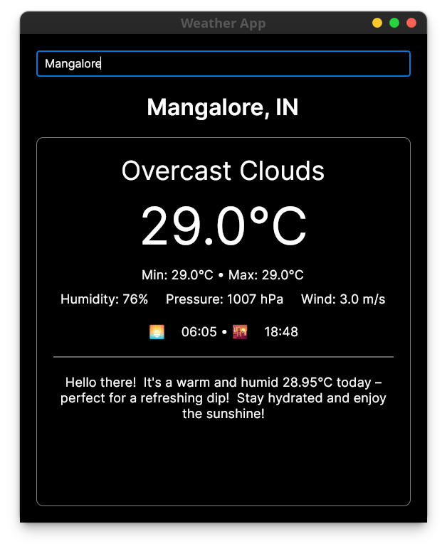

# Weather App

A cross-platform desktop weather application built with Avalonia UI and .NET. Get real-time weather information and AI-powered weather advice using OpenWeather API and Google's Gemini AI.



## Features

- Real-time weather data from OpenWeather API
- Location-based weather information
- Detailed weather metrics:
  - Temperature (current, min/max)
  - Humidity
  - Wind speed
  - Pressure
  - Sunrise/Sunset times
- AI-powered weather advice using Gemini
- Clean, modern UI with Avalonia
- Cross-platform support (Windows, macOS, Linux)

## Prerequisites

- [.NET 7.0 SDK](https://dotnet.microsoft.com/download/dotnet/7.0) or later
- API Keys:
  - [OpenWeather API Key](https://openweathermap.org/api)
  - [Google Gemini API Key](https://makersuite.google.com/app/apikey)

## Setup & Installation

1. Clone the repository:

```bash
git clone https://github.com/yourusername/WeatherApp.git
cd WeatherApp
```

2. Install dependencies:

```bash
dotnet restore
```

3. Create a `.env` file in the project root:

```env
WEATHER_API_KEY=your_openweather_api_key_here
GEMINI_API_KEY=your_gemini_api_key_here
```

4. Build the project:

```bash
dotnet build
```

## Running the Application

### Development

```bash
dotnet run
```

### Platform-Specific Builds

#### Windows

```bash
dotnet publish -c Release -r win-x64 --self-contained true
```

#### macOS

```bash
dotnet publish -c Release -r osx-x64 --self-contained true
```

#### Linux

```bash
dotnet publish -c Release -r linux-x64 --self-contained true
```

## Development Requirements

### Windows

- Visual Studio 2022 or VS Code
- .NET 7.0 SDK
- Windows 10 or later

### macOS

- Visual Studio for Mac or VS Code
- .NET 7.0 SDK
- macOS 10.15 or later
- Xcode Command Line Tools:

```bash
xcode-select --install
```

### Linux

- VS Code
- .NET 7.0 SDK
- Required packages:

```bash
# Ubuntu/Debian
sudo apt-get update
sudo apt-get install -y libgtk-3-dev
sudo apt-get install -y libwebkit2gtk-4.0-dev

# Fedora
sudo dnf install gtk3-devel
sudo dnf install webkit2gtk3-devel
```

## Project Structure

```
WeatherApp/
├── Assets/             # Images and icons
├── Models/             # Data models
├── ViewModels/         # MVVM ViewModels
├── Views/              # XAML Views
├── Converters/         # Value converters
├── .env               # API keys configuration
└── README.md          # Documentation
```

## Dependencies

- Avalonia UI: Cross-platform UI framework
- ReactiveUI: MVVM framework
- DotNetEnv: Environment variable management
- System.Net.Http: HTTP client for API calls
- System.Text.Json: JSON serialization

## Contributing

1. Fork the repository
2. Create a feature branch
3. Commit your changes
4. Push to the branch
5. Create a Pull Request

## License

This project is licensed under the MIT License - see the [LICENSE](LICENSE) file for details.

## Acknowledgments

- [OpenWeather API](https://openweathermap.org/api) for weather data
- [Google Gemini AI](https://deepmind.google/technologies/gemini/) for weather advice
- [Avalonia UI](https://avaloniaui.net/) for the cross-platform UI framework

## Support

For support, please open an issue in the GitHub repository.
